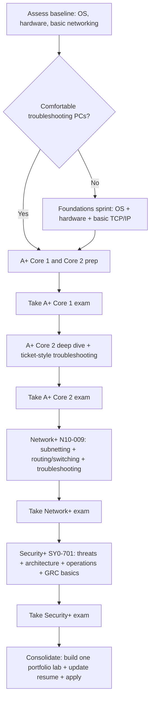

# ed2go CompTIA Trifecta Program and Certification Strategy

## Executive summary

The entity["organization","ed2go","online career training provider"] “CompTIA Certification Training: A+, Network+, Security+ (Vouchers Included)” sold through Rowan College of South Jersey is positioned as an open-enrollment, self-paced program with an instructor-moderated component, designed to cover the CompTIA “trifecta” and to include exam vouchers. The standardized ed2go catalog listing shows **12 months / 395 course hours** and **$4,295 USD** tuition for course code **GES327**. citeturn26search6

From a credibility lens: the partner institution (entity["organization","Rowan College of South Jersey","gloucester campus sewell nj"]) is regionally accredited by the entity["organization","Middle States Commission on Higher Education","regional accreditor us"], which supports institutional legitimacy, but the ed2go program itself is typically **non-credit workforce training** (certificate of completion, not a college credential), and the CompTIA certifications still depend on passing third-party exams. citeturn16search0turn17search3

From a value-for-money lens: retail CompTIA voucher pricing from the official CompTIA marketplace implies that buying vouchers directly is roughly **$1,345** for A+ (two exams), Network+, and Security+ combined, before you buy any study materials. citeturn23search0turn23search4 This creates a large tuition premium for ed2go that only makes sense for certain learner profiles: people who strongly benefit from structured coursework, advising, included labs, or who are using employer/WIOA funding and need a packaged program with reporting requirements. citeturn26search9

Two material risk areas to verify before purchase:
- **Exam-version alignment for A+**: some ed2go partner pages still reference the retired A+ 220-1101 / 220-1102 exams, even though CompTIA retired that series in 2025. citeturn9search0turn10search6 However, ed2go’s own partner product-update notes indicate GES327 course materials and labs were updated to cover the **A+ 1200 series** content (the current series). citeturn26search1turn26search7
- **Voucher timing/terms**: CompTIA vouchers are time-limited (typically 12 months), non-refundable, and can become invalid if an exam retires. citeturn25search4turn25search0 If ed2go provides vouchers early, you want to ensure you can sit all exams within both the course window and voucher validity.

Recommendation in one line: if you already have meaningful hands-on practice (and your attached homelab documentation strongly suggests you do), the most rational route is usually **self-study + direct purchase of vouchers (with optional retake bundles only where you truly need insurance)**; use ed2go mainly when you need structure, accountability, or third-party funding. citeturn23search0turn2file0

## ed2go program at Rowan College of South Jersey

### What the program claims to include

The standardized ed2go catalog entry for the trifecta program (course code **GES327**) lists:
- **Format**: open enrollment, self-paced, “instructor-led” via moderated discussion area
- **Time allowance**: **12 months** to complete
- **Work estimate**: **395 course hours**
- **Tuition**: **$4,295 USD**
- **Scope**: A+, Network+, Security+ preparation
- **Practice/labs**: mentions practice questions and optional simulations / live virtual machine labs
- **Vouchers**: “includes vouchers that cover the fee/cost to sit for the certifying exams.” citeturn18search2turn17search0turn17search1

The Rowan College of South Jersey A+ page (which cross-links to the trifecta bundle) explicitly lists the trifecta bundle price and links to the program page. citeturn17search2

### Exactly which exams are included in the ed2go package

Based on the ed2go trifecta description (“receive an exam voucher for each certification exam”) and the fact that CompTIA A+ requires **two** exams, the package is best interpreted as including **four exam vouchers total**:
- CompTIA A+ Core 1 voucher (one exam attempt)
- CompTIA A+ Core 2 voucher (one exam attempt)
- CompTIA Network+ voucher (one exam attempt)
- CompTIA Security+ voucher (one exam attempt) citeturn17search2turn18search2

**Exam series codes (what you should expect in 2026):**
- **A+**: 220-1201 (Core 1) and 220-1202 (Core 2) are the current A+ V15 series (launched March 25, 2025). citeturn25search3turn25search1  
- **Network+**: N10-009 is the current series (launch June 20, 2024). citeturn14search0  
- **Security+**: SY0-701 is the current series (launch November 7, 2023). citeturn12search2turn15search0  

**Why this needs an extra verification step for A+ on the RCSJ storefront:** at least one RCSJ ed2go page (TECH+ and A+) still references 220-1101 / 220-1102. Those exams were retired for English in September 2025 and for other languages in December 2025. citeturn9search0turn10search6  
At the same time, ed2go partner product-update notes state that GES327 was updated with “Level Up” content and that current labs/materials cover the **1200 series** content, which strongly suggests the underlying course is now aligned to the current A+ series even if a storefront page lags. citeturn26search1turn26search7

**Bottom line on exam inclusion:** you should assume the package intends to include vouchers for **A+ (220-1201 and 220-1202), Network+ (N10-009), Security+ (SY0-701)**, but because CompTIA vouchers can be exam-series specific, confirm the exact A+ series your vouchers will be issued for before paying. citeturn25search0turn26search7

### Are proctored exams provided, or only vouchers?

ed2go provides **vouchers**, not exam delivery. The exam is administered through entity["company","Pearson VUE","computer-based testing provider"] either:
- at a physical testing center, or
- as a remotely proctored online exam (OnVUE). citeturn13search8turn13search11turn13search1  

Online proctoring has strict requirements (no VPNs/VMs, one monitor, minimum bandwidth, room scan). citeturn13search0turn13search3turn13search2

### Program reliability and credibility

**Institutional credibility (partner school).** Rowan College of South Jersey is institutionally accredited by the Middle States Commission on Higher Education, and this is corroborated both by RCSJ and by the entity["organization","Council for Higher Education Accreditation","us higher ed accreditor directory"] directory listing for the institution. citeturn16search0turn16search11

**Platform/operator credibility.** ed2go describes itself as part of entity["company","Cengage Learning","education company"], and claims a large footprint (thousands of partner institutions and millions of served students). citeturn18search4

**Instructor qualifications (as published).** On ed2go’s standardized trifecta listing, multiple instructors are named with experience summaries; at least one instructor bio includes extensive cybersecurity focus and another includes degrees and authorship/teaching experience. citeturn17search0turn17search1  
These bios are meaningful but should be treated as marketing claims until cross-verified (for example, via independent professional profiles).

**Refund and guarantee policies.**
- ed2go’s Advanced Career Training refund terms commonly include a **10-day window** for a full tuition refund, conditioned on limited progress and returning physical materials; importantly, the terms explicitly exclude refunds for non-returnable items such as **software, memberships, exam vouchers, and exam sponsorship**, and also note that partner-school policies can be more stringent. citeturn16search5turn16search2  
- Separately, CompTIA’s own policies emphasize that neither CompTIA nor its official materials guarantee a passing result. citeturn14search4  
- Bootcamp-style “pass guarantees” exist in the marketplace, but they are provider-specific and typically have strict eligibility rules; they are not a standard CompTIA guarantee. citeturn24search3

**Student reviews and complaint signals.** Third-party reviews for ed2go as a company are mixed-to-negative in the sources that were easily attributable:
- entity["company","Trustpilot","reviews platform"] shows a small set of highly negative reviews (very small sample size, but severe complaints about access/support). citeturn18search1turn26search5  
- entity["organization","Better Business Bureau","us nonprofit consumer org"] complaint narratives include allegations about misleading marketing, support, and access to materials post-completion (note: complaints are individual allegations and not proof, but they are a real risk signal). citeturn18search3turn26search0  
- Anecdotal forum commentary includes explicit warnings about studying against discontinued exam versions and voucher-release friction; treat as non-representative but still relevant to version-alignment due diligence. citeturn18reddit46  

**Practical credibility conclusion.** The program is credible enough to be “real” (legitimate institution partner, long-running provider, published instructors, explicit refund terms), but reliability risk concentrates in operational execution: platform support responsiveness, material access, and ensuring exam-version accuracy amid frequent CompTIA updates. citeturn16search0turn18search4turn14search4

**Use of your LinkedIn profile.** The provided LinkedIn URL could not be retrieved via public crawl/search in this research session (likely indexing/privacy restrictions), so the personalization elements below rely primarily on your attached homelab/runbook documentation rather than your LinkedIn history. citeturn2file0

## CompTIA exam ecosystem

### Current exam codes, formats, and “difficulty” anchors

CompTIA does not publish exam pass rates, and explicitly states it does not disclose passing rates because questions and passing rates can change. citeturn14search2turn14search4  
So the most defensible “difficulty” discussion uses what CompTIA does publish: scope, recommended experience, question types, time limits, and passing score thresholds.

**CompTIA A+**
- **Exams**: Core 1 (220-1201) and Core 2 (220-1202). citeturn25search3turn25search1  
- **Format**: up to 90 questions each; multiple choice and performance-based questions (PBQs); 90 minutes per exam. citeturn25search3turn25search1  
- **Passing score**: 675/900 for Core 1; 700/900 for Core 2. citeturn25search3turn25search1  
- **Recommended experience**: about 12 months in an IT support specialist role. citeturn25search3  
- **Version constraint**: Core 1 and Core 2 must be taken from the same version (no mixing). citeturn25search3turn25search1  

**CompTIA Network+**
- **Exam**: N10-009. citeturn14search0  
- **Format**: up to 90 questions; multiple choice and PBQs; 90 minutes. citeturn14search0  
- **Passing score**: 720/900. citeturn14search0  
- **Recommended experience**: A+ plus 9 to 12 months hands-on in a junior network admin or network support role. citeturn14search0  

**CompTIA Security+**
- **Exam**: SY0-701. citeturn12search2turn15search0  
- **Format**: up to 90 questions; multiple choice and PBQs; 90 minutes. citeturn12search2turn15search0  
- **Passing score**: 750/900. citeturn12search2turn15search0  
- **Recommended experience**: Network+ plus about two years in IT administration with a security focus (or security/systems admin role). citeturn15search0turn15search3  
- **Retirement timing**: CompTIA describes retirement as “usually three years after launch” and does not consistently publish a fixed retirement date far in advance; treat 2026 as a plausible window for the next refresh, but do not plan on a specific day without confirmation from CompTIA. citeturn12search2turn22search3  

### Retail prices and voucher options (US)

The most defensible “retail” pricing is the official CompTIA store/marketplace pricing:

| Certification | Exams required | Current exam code(s) | Official voucher price (USD) | Official voucher + retake price (USD) |
|---|---:|---|---:|---:|
| A+ | 2 | 220-1201 and 220-1202 | $265 each | $530 each |
| Network+ | 1 | N10-009 | $390 | $439 |
| Security+ | 1 | SY0-701 | $425 | $808 |

citeturn23search0turn23search1turn23search4

**CompTIA voucher policy constraints that matter for budgeting**
- Vouchers are generally valid for about **12 months**, expire, and cannot be extended; purchases are final and non-refundable. citeturn25search4turn25search7turn25search0  
- Vouchers are country/currency specific and exam-series specific; exam retirement can invalidate vouchers for that series. citeturn25search0turn13search4  
- CompTIA warns that vouchers obtained from unauthorized sellers may be voided. citeturn25search0  

### Exam logistics: in-person vs online proctoring

CompTIA exams can be scheduled through Pearson VUE for in-person or online delivery. citeturn13search8turn13search11  
For online proctoring (OnVUE), CompTIA and Pearson VUE emphasize:
- run a system test in advance, use a compliant OS, avoid corporate firewalls/VPNs/VMs
- single-display requirement
- bandwidth minimums
- clean desk and room scan requirements, with forfeiture risk if non-compliant. citeturn13search1turn13search0turn13search3turn13search2  

Retake rules: if you fail the first attempt you may retake without restriction; after a second failure you must wait at least 14 days. citeturn13search6

## Difficulty, pass rate evidence, and self-study resources

### What can be said rigorously about pass rates and difficulty

CompTIA’s explicit stance is that it does **not** publish exam passing rates, and scaled scoring means you cannot infer “percent correct needed” from the passing score. citeturn14search2turn14search9  
For decision-making, treat “difficulty” as a composite of:
- breadth and novelty of content relative to your background
- amount of hands-on practice you can realistically do
- PBQ comfort, time management, and test-day execution.

A reasonable ordering for most learners is:
- **A+**: broad but more concrete; many topics are familiar if you have built/troubleshot PCs.
- **Network+**: conceptually tighter but technically sharper (subnetting, protocols, troubleshooting).
- **Security+**: broader conceptual surface area, with more governance/risk language layered on top of technical foundations. citeturn25search3turn14search0turn15search0

### Study-hour estimates, anchored to published timeframes

The ed2go trifecta program is estimated at **395 course hours** over **12 months**, which is a useful reality check: it implies the full “trifecta” is commonly closer to “hundreds of hours” than “a weekend.” citeturn18search2turn26search6

For self-study planning, a conservative estimate for an “unspecified prior IT experience” learner is:

- **A+ (both cores)**: Professor Messer notes many students average about **three to four months** for both exams. If you study 8 to 12 hours per week, that corresponds to roughly **100 to 190 hours** total. citeturn19search8  
- **Network+**: CompTIA’s recommended experience baseline is A+ plus 9 to 12 months in a junior networking role; learners below that baseline should expect to allocate substantial lab time. citeturn14search0  
- **Security+**: CompTIA recommends Network+ plus about two years of IT administration with security focus; CompTIA’s own blog guidance (for people closer to that baseline) suggests 30 to 40 hours of study, which implies that “true beginners” should plan materially more. citeturn15search0turn15search6  

### Recommended resources with pros/cons and when to use them

**Official CompTIA resources**
- Official exam objectives and official practice questions are available directly from CompTIA pages (A+, Network+, Security+). Pros: authoritative scope control. Cons: objectives do not teach you; they only define coverage. citeturn25search5turn14search0turn12search2  
- Official CompTIA Security+ Study Guide (SY0-701) pricing is listed by CompTIA Learning (print and eBook). Pros: mapped to official objectives and evaluated for coverage. Cons: higher cost than many third-party books. citeturn15search12  
- CertMaster ecosystem (Learn/Practice/Labs) can be bought in bundles; pros are integration and PBQ-style practice, cons are cost and variable learner preference. citeturn23search5turn12search16  

**High-signal third-party resources (commonly used)**
- entity["people","Professor Messer","it certification educator"]: widely used free video training, plus paid notes and study groups; he explicitly warns against using prior-version materials and documents major differences between A+ exam versions. Pros: strong clarity-to-cost ratio (often free). Cons: requires self-discipline and adding labs/practice tests elsewhere. citeturn19search8  
- Dion Training: published course-length guidance suggests substantial video hours for A+, Network+, and Security+, which can help you budget “watch time” vs “lab time.” Pros: structured video paths. Cons: video time is not the same as mastery; you still need labs and practice exams. citeturn19search2  

**Labs: how to make them real using your attached homelab**

Your attached documentation shows a serious home environment: a multi-node Proxmox cluster, DNS via dual Pi-hole, reverse proxy, identity/SSO, TrueNAS storage, VPN routing, and multiple VMs/containers. fileciteturn2file0 fileciteturn2file1

That environment is excellent for Network+ and Security+ “realism,” but it also has an operational warning: the homelab status notes include a **degraded cluster** and a **critical boot NVMe issue** on a primary node. fileciteturn2file0  
So the practical approach is:
- Use the homelab for controlled labs and long-horizon learning.
- In the final 2 weeks before an exam, rely on a more stable “exam-week lab” (for example, a dedicated local VM set) so your preparation is not held hostage by hardware incidents.

## Cost and timeline comparisons

### Cost comparison table

All costs are USD and reflect the most directly cited price points from primary sources.

| Path | Training cost | Exam voucher cost | Total direct cost | Notes |
|---|---:|---:|---:|---|
| ed2go trifecta bundle (RCSJ storefront) | $4,295 | Included (claimed) | $4,295 | 12 months, 395 hours, vouchers included. citeturn17search2turn26search6turn18search2 |
| Self-study + CompTIA retail vouchers | $0 to variable | $1,345 | $1,345 + variable | Uses CompTIA official voucher pricing: A+ (2 x $265) + Network+ ($390) + Security+ ($425). citeturn23search0turn23search4 |
| Self-study + CompTIA “retake insurance” for all exams | $0 to variable | $2,307 | $2,307 + variable | Uses CompTIA official voucher+retake pricing for each exam. citeturn23search1turn23search0 |
| Self-study + example authorized-partner discounted vouchers | $0 to variable | about $1,145 to $1,171 | $1,145 to $1,171 + variable | Example discount store shows lower pricing (often membership-based). Verify partner status and voucher expiry before buying. citeturn23search3turn25search0 |

Interpreting the premium: compared to buying retail vouchers directly ($1,345), the ed2go tuition premium is roughly **$2,950**. citeturn26search6turn23search0  
You are effectively paying that premium for: structured curriculum, platform, instructor moderation, included labs/simulations, advising/admin support, and the convenience of bundling. citeturn18search2turn17search0

### Timeline comparison (typical ranges)

Because CompTIA does not publish pass rates and learners vary wildly, a timeline table is most honest when tied to known program lengths and to “typical bootcamp schedules” rather than pretending there is one true answer.

| Approach | Typical calendar length | Study intensity | What it optimizes for |
|---|---|---|---|
| ed2go trifecta bundle | Up to 12 months access | Moderate, steady | Structured long runway with built-in hours estimate (395). citeturn18search2turn26search6 |
| Self-study (trifecta) | ~6 to 9 months is common for many working adults | Moderate | Lowest cost, best fit for self-directed learners; flexible sequencing. citeturn19search8turn14search0turn15search0 |
| Bootcamp model (per exam) | Often ~5 days per exam plus pre/post work | High | Fast immersion and deadlines; not a substitute for practice testing and labs. citeturn24search9turn24search3 |

### Is a bootcamp/course necessary?

A course or bootcamp is rarely “necessary” in a strict sense. What is necessary is:
- current-version materials,
- enough practice on PBQ-type tasks,
- enough full-length practice exams to expose weak domains,
- a schedule that prevents drift.

A bootcamp is most defensible for these profiles:
- **Deadline-driven learners** who do not self-pace well.
- **Career changers under time pressure** (for example, job offer contingent on Security+ in 30 to 60 days).
- **Employer-funded cohorts** where the organization wants a predictable completion window and reporting. citeturn26search9turn24search3

Self-study is usually best for:
- Learners with strong hands-on curiosity and the ability to maintain routine.
- Learners who already run real systems. Your homelab documents show you operate routing, DNS, reverse proxying, SSO, storage, and monitoring, which strongly reduces the “novelty burden” for Network+ and Security+ labs. fileciteturn2file0 fileciteturn2file1

## Recommended study path and study plans

image_group{"layout":"carousel","aspect_ratio":"1:1","query":["CompTIA A+ logo","CompTIA Network+ logo","CompTIA Security+ logo","ed2go logo"],"num_per_query":1}

### Recommended study path flowchart

### Lab strategy using your homelab (high leverage, low fluff)

Your attached materials describe:
- a Proxmox cluster with VMs/LXC
- Pi-hole DNS
- reverse proxy
- Authentik SSO
- TrueNAS-backed storage
- Tailscale routing
- multiple service endpoints. fileciteturn2file0 fileciteturn2file1

That stack can be mapped to exam outcomes:

- **A+ labs**: create and document a Windows 11 install workflow, driver troubleshooting, OS recovery, user/profile troubleshooting, and basic Linux scripting in a VM.
- **Network+ labs**: subnetting in practice (assign and route multiple subnets), DNS troubleshooting (primary/secondary resolvers), service ports, NAT concepts, and packet-capture exercises between VMs.
- **Security+ labs**: MFA/SSO concepts (Authentik), least privilege, secure service exposure via reverse proxy, logging/monitoring basics, and incident-style “trace what happened” drills.

Operational caution: your canonical homelab notes flag degraded cluster health and a critical boot disk issue. Treat the homelab as valuable, but do not let production fragility derail exam-week prep; keep a small separate lab environment as a fallback. fileciteturn2file0

### Twelve-week self-study plan (aggressive, assumes prior exposure)

This schedule targets: A+ Core 1 by end of week 3 to 4, A+ Core 2 by end of week 5 to 6, Network+ by end of week 8 to 9, Security+ by end of week 12. It is realistic only if you can sustain high weekly hours and you already have meaningful familiarity with troubleshooting and networking concepts. citeturn25search3turn14search0turn15search0

**Week 1**  
Milestones: lock exam versions (A+ 220-1201/1202, N10-009, SY0-701), download exam objectives, set a practice-test baseline. citeturn25search3turn14search0turn12search2  
Labs: create two VMs (Windows + Linux) and write a one-page “restore plan” (snapshots, rollback procedure).

**Week 2**  
A+ Core 1 focus: hardware, mobile, virtualization/cloud basics, SOHO networking. citeturn25search3  
Labs: build a virtual “user support ticket”: intermittent Wi-Fi, driver issue, and printer installation.

**Week 3**  
A+ Core 1 focus: troubleshooting methodology and mixed PBQs.  
Practice tests: two timed mini-exams; review every miss; build an error log. citeturn14search9  

**Week 4**  
Take A+ Core 1 exam (end of week).  
A+ Core 2 begins: OS installation and tool usage; security baselines. citeturn25search1turn25search3  

**Week 5**  
A+ Core 2: Windows troubleshooting, malware response, operational procedures. citeturn25search1turn25search3  
Labs: Windows local policies, basic BitLocker concepts, restore point vs full reimage.

**Week 6**  
Practice tests: two full timed Core 2 practice exams; remediate weak objectives.  
Take A+ Core 2 exam (end of week).

**Week 7**  
Network+ foundation: OSI, TCP/IP, ports/protocols, addressing/subnetting (daily drills). citeturn14search0  
Labs: configure two subnets in your lab and prove connectivity; document IP plan.

**Week 8**  
Network+ implementation/operations: routing concepts, switching, wireless, monitoring. citeturn14search0  
Labs: packet capture of DNS, DHCP, and TCP handshake between two hosts.

**Week 9**  
Network+ troubleshooting focus (largest weight domain) and PBQs. citeturn14search0  
Take Network+ exam (end of week).

**Week 10**  
Security+ domains: general security concepts, threats/vulns/mitigations. citeturn15search0turn15search3  
Labs: harden one service behind reverse proxy; document before/after exposure.

**Week 11**  
Security+ architecture and operations: identity/access, secure design, monitoring/response. citeturn15search0turn15search3  
Practice tests: two full timed Sec+ exams; build a remediation list by domain weight.

**Week 12**  
Security+ governance/risk emphasis and final review.  
Take Security+ exam (mid-to-late week).  
Retake planning: if you fail, apply CompTIA waiting rules and schedule retake strategy. citeturn13search6

### Twenty-four-week self-study plan (more realistic for “unspecified background”)

This plan assumes moderate weekly capacity and builds more lab repetition, especially before Network+ and Security+.

**Weeks 1 to 6 (A+ Core 1)**  
- Weeks 1 to 2: hardware, mobile, virtualization intro; build lab VMs and snapshots. citeturn25search3  
- Weeks 3 to 4: networking basics, troubleshooting drills, PBQ practice patterns.  
- Weeks 5 to 6: two full practice exams; take Core 1 at end of week 6. citeturn14search9  

**Weeks 7 to 10 (A+ Core 2)**  
- OS installation and tool mastery; security procedures; ticket-based troubleshooting. citeturn25search1turn25search3  
- Practice test cadence: one timed practice every week starting week 8.  
- Take Core 2 near end of week 10.

**Weeks 11 to 16 (Network+)**  
- Weeks 11 to 12: subnetting and routing fundamentals (daily), cabling/wireless concepts. citeturn14search0  
- Weeks 13 to 14: operations and monitoring; config management thinking.  
- Weeks 15 to 16: troubleshooting domain and PBQs; two full timed exams; take Network+ end of week 16. citeturn14search0turn14search9  

**Weeks 17 to 24 (Security+)**  
- Weeks 17 to 19: threats/vulns, mitigations, crypto concepts in context. citeturn15search0turn15search3  
- Weeks 20 to 21: security architecture and IAM; map your SSO/identity lab behaviors to objectives. citeturn15search0turn15search3  
- Weeks 22 to 23: security operations, incident response drills; two full timed practice exams.  
- Week 24: final review and exam.

### A final, practical note grounded in your attached docs

Your infrastructure is an unusually strong study asset, but it is also a living system with real failure modes (critical boot NVMe issue and degraded quorum are explicitly documented). Treat exam prep like a release process:
- freeze major infrastructure changes 10 to 14 days before each exam
- keep a small “known-good” lab VM set aside for the final review window
- document every lab like it is a ticket that someone else has to resolve. fileciteturn2file0